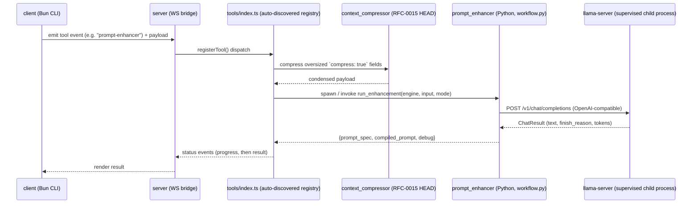
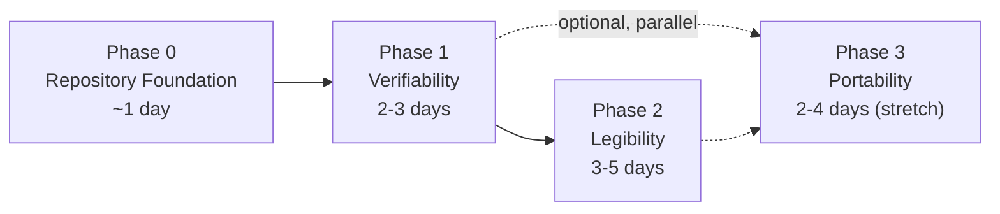

# RFC 0025 — Repository Launch & Portfolio Readiness

> Status: **Proposed** — 2026-07-20
> Author: Emanuele (with Claude as drafting assistant)
> Supersedes: none. First RFC actually committed to `.sinapsi/rfc/` — RFC-0002 through RFC-0024
> are cited throughout the codebase but were never written to disk (see Context § "Broken
> traceability"). This RFC is deliberately written in English; see Decision § 6 for why.

## Context

### What this project actually is

Cowork is a locally-supervised LLM infrastructure, not a thin wrapper around a hosted API. A
Bun/TypeScript server exposes a WebSocket event bridge to a CLI client; a quantized Qwen3-8B
model is served by an external `llama-server` process that the TypeScript layer supervises
(health polling, exponential-backoff restart, clean shutdown hooks); and a Python module
(`prompt_enhancer`) compiles incomplete natural-language requests into implementation-ready
specifications through a three-tier generation strategy with deterministic fallbacks at every
level.



### The audit

A full read of `client/`, `server/`, and `.sinapsi/` (2026-07-20) found the engineering itself to
be senior-level — process supervision, measured performance tuning (documented tok/s, VRAM, and
TTFT benchmarks in `server/config.ts`), a `Protocol`-based provider abstraction anticipating
multiple LLM backends (`server/modules/prompt_enhancer/providers/base.py`), and a layered defense
against LLM non-determinism (compiler → single_pass → field_loop, each with its own parser and
fallback). **23 distinct RFCs are cited in code comments** (`RFC-0002` … `RFC-0024`, verified via
a full-repo grep), which is a real decision trail.

None of that is visible or verifiable from outside the working directory today:

| Gap | Evidence |
|---|---|
| Not a git repository | `git status` fails outside a repo; zero commits exist |
| No README anywhere | `find . -iname "README*"` returns nothing in `client/`, `server/`, or root |
| No LICENSE | absent at root |
| Zero automated tests | only test files found live under `server/modules/.venv/**` (third-party deps) |
| No CI | `.github/` contains only `copilot-instructions.md`, no workflow |
| ~7.9 GB vendored, Windows-only | `server/bin/` (CUDA DLLs + `llama-server.exe`, 1.2 GB), `server/models/*.gguf` (4.7 GB), `server/modules/.venv/` (2.0 GB) — all correctly `.gitignore`d, but nothing else lets a clone run |
| **Broken traceability** | `.sinapsi/rfc/` and `.sinapsi/adr/` contain only `000-template.md`; the 23 RFCs cited in code do not exist as documents |
| Italian-only comments/docstrings | 100% of inline rationale, including the RFC citations themselves |

None of these are code defects. They are why a genuinely strong system currently reads, to an
outside reviewer, as an abandoned local script — and why this RFC exists: per this project's own
convention (`AGENT_INSTRUCTIONS.md` § Decisions), an RFC is required *before* a boundary moves,
and this proposal moves several at once — version control adoption, a public license, a test
framework, a CI system, a documentation-language policy, and a module boundary inside
`workflow.py`.

### Non-goals

- Rewriting the prompt-compiler logic, sampler presets, or GPU tuning. They are already measured
  and documented; touching them is out of scope here.
- Altering `run_enhancement_field_loop` — explicitly marked "must not be altered" in
  `workflow.py` (RFC-0005 § crit. 4). This RFC does not reopen that decision.
- Multi-user auth, remote deployment, or a hosted version of the local stack. The WS server's
  trust boundary stays localhost-only by design (made explicit in Phase 2, not changed).
- Translating every historical Italian comment. See Decision § 6 for the scoped alternative.

## Proposal

Four phases, meant to run **sequentially** — each phase's acceptance criteria are the
prerequisite for the next one being credible, not just for it being possible.



### Phase 0 — Repository Foundation (~1 day)

**Goal:** stop being a folder; become a repository someone else can land on.

| # | Task | Detail |
|---|---|---|
| 0.1 | `git init` + staged history | Do **not** land as one mega-commit. Stage in logical slices — e.g. `server: WS bridge + tool runtime`, `server: prompt_enhancer module`, `server: llm supervisor + context compressor`, `client: CLI`, `docs: sinapsi workflow`, `chore: gitignore` — so `git log --oneline` itself reads as an engineered import, not a dump. |
| 0.2 | Secret sweep | Before the first commit: read `client/.env` in full and confirm no live keys; if any exist, rotate them, then replace with `client/.env.example` (placeholders + one-line comment per variable). Run `git grep -i -E "(api[_-]?key|secret|token|password)"` on the staged tree as a final gate. |
| 0.3 | `.gitignore` confirmation | Root, `client/`, and `server/.gitignore` were already verified correct during the audit (they exclude `node_modules`, `.venv`, `bin/`, `*.gguf`, `.sinapsi/graph.json`). No changes needed — just confirm with `git status` that nothing in those paths shows as trackable before committing. |
| 0.4 | `LICENSE` | MIT. Reasoning: this is a demo/portfolio artifact, not a library asking downstream projects to worry about patent grants (which is where Apache-2.0 earns its complexity) — MIT reads as the simpler, standard choice for this kind of repository. |
| 0.5 | Root `README.md` | Skeleton, filled as later phases complete: <br>1. One-paragraph pitch (see Consequences § pitch text below) <br>2. Architecture diagram (embed the Phase-2 `architecture.md` diagram) <br>3. Quickstart — both the cloud-provider path and the full local/GPU path once Phase 3 lands <br>4. Link to `.sinapsi/rfc/` as the decision log <br>5. CI badge (added end of Phase 1) |
| 0.6 | Root dev convenience | Optional: a two-line `docs/DEV.md` note ("run `bun run dev` in `server/`, then in `client/`, in two terminals") rather than a synthetic root `package.json` that would misrepresent the workspace as a single package. |

**Acceptance:** `git log` shows a multi-commit, logically staged history; `git status` is clean;
README renders with every link resolving; LICENSE present; secret sweep documented as done.

### Phase 1 — Verifiability (2-3 days)

**Goal:** replace "trust me" with a green check mark.

**1.1 — Python tests** (new `server/modules/requirements-dev.txt`, kept separate from the
production `requirements.txt` on purpose — that file is intentionally `ddgs`-only per its own
documented stdlib-first philosophy tied to RFC-0014/0020; a test dependency does not belong in
the runtime requirement set). Target: `server/modules/prompt_enhancer/workflow.py`, all pure
functions:

- `normalize_generated_prompt` — strips a leading "here is"/"ecco" line, strips ``` fences,
  returns `""` unchanged for empty input.
- `extract_json_objects` — pulls multiple JSON objects out of mixed/noisy text; skips malformed
  `{`; returns `[]` when nothing parses.
- `extract_value_from_mixed_output` — prefers the *last* `{"value": ...}` block; falls back to a
  `{target_field: ...}` block; returns `None` when neither exists.
- `coerce_value_from_raw` — bullet/numbered-list extraction for list fields; JSON-or-fallback for
  `output_format`; boilerplate stripping for scalars.
- `normalize_field_value` — enforces list-typed fields stay lists (else fallback), enforces
  `output_format` stays `{type, structure}` (else fallback).
- `classify_target` — the EN+IT technical-signal regex: assert both language triggers and the
  conversational default.
- `build_specification` / `build_compiled_prompt` — empty sections are omitted, not rendered as
  dangling headers; `directive` fallback fires when the field is blank.

These are the exact functions absorbing an LLM's unpredictable output — the highest-risk,
zero-external-dependency, easiest-to-test code in the repository. This is where a test suite pays
for itself first.

**1.2 — TypeScript tests** (`bun test`):

- `tools/index.ts` `discoverTools()` — a fixture `Tool` export is registered; files in `EXCLUDED`
  are skipped.
- `tools/fs.ts` `createFileOps()` — throws when the op is not in the connection's advertised set;
  emits the correct `fileop` payload when it is.
- `tools/runtime.ts` `collectCompressFields()` — regression test for the exact bug documented
  inline: a `compress: true` field nested under `sub_prompts['read-project']` must be collected,
  not just top-level `tool.prompts` entries.

**1.3 — CI** (`.github/workflows/ci.yml`), `ubuntu-latest`. Explicitly scoped: this validates
logic, not the GPU stack — the Windows-only `llama-server.exe` + CUDA DLLs are out of CI's reach
by design, and the workflow should say so in a comment rather than silently omitting them.

```yaml
name: ci
on: [push, pull_request]
jobs:
  server:
    runs-on: ubuntu-latest
    steps:
      - uses: actions/checkout@v4
      - uses: oven-sh/setup-bun@v2
      - uses: actions/setup-python@v5
        with: { python-version: "3.12" }
      - run: bun install
        working-directory: server
      - run: bun run typecheck
        working-directory: server
      - run: bun test
        working-directory: server
      - run: pip install -r modules/requirements.txt -r modules/requirements-dev.txt
        working-directory: server
      - run: pytest modules/prompt_enhancer
        working-directory: server
        # Note: this validates the compiler/parsing logic only. The GPU inference path
        # (llama-server + vendored CUDA binaries) is Windows-only and out of scope for CI —
        # see Phase 3 for a CI-runnable provider.
  client:
    runs-on: ubuntu-latest
    steps:
      - uses: actions/checkout@v4
      - uses: oven-sh/setup-bun@v2
      - run: bun install
        working-directory: client
      - run: bun run typecheck
        working-directory: client
```

**1.4 — Lint/format:** Biome for both `client/` and `server/` TypeScript (one fast binary, fits a
Bun-first stack — no need for the ESLint+Prettier pair here); Ruff for Python. Wire both into the
CI job above as an additional step each; document `bun run lint` / `ruff check` in `docs/DEV.md`.

**1.5 — Docs-language policy (scoped, not a full pass):** translate to English only the
highest-leverage surfaces — module-level docstrings in `workflow.py`, `config.ts`,
`supervisor.ts`, `providers/base.py`, `fs.ts`, `runtime.ts` — plus anything a Phase-2 RFC or the
README will directly quote. Historical inline rationale comments stay Italian and get translated
opportunistically when a file is next touched for another reason. This is an explicit, bounded
decision (see Decision § 6), not deferred indefinitely.

**Acceptance:** CI is green on a fresh clone with no local state; `pytest` and `bun test` both
report a non-zero, passing test count; lint runs clean; README gets its CI badge.

### Phase 2 — Legibility (3-5 days)

**Goal:** make the "why" readable without opening 900 lines of Python.

**2.1 — `docs/architecture.md`:** the sequence diagram from this RFC's Context, refined; a
component/module-boundary diagram; and an explicit **Threat model** section stating what is
today implicit — WS server is localhost-only with no authentication, by design, for a
single-operator local tool; the only outbound network call is the opt-in DuckDuckGo grounding
lookup in `search.py` (RFC-0020), named explicitly rather than left for a reviewer to discover by
reading imports.

**2.2 — Backfill six real RFCs into `.sinapsi/rfc/`**, chosen as the highest-signal, most-cited,
most distinct decisions — spanning protocol design, security, ops, cross-cutting infra, product
design, and performance, deliberately covering different skills rather than six variations on one
theme:

| RFC | Decision | Primary source to mine |
|---|---|---|
| 0002 | WebSocket event protocol (foundation) | `server/lib/ws.ts`, `client/lib/ws.ts` |
| 0008 | Client-declared file-operation capability negotiation | `server/tools/fs.ts`, `client/events/fileop.ts` |
| 0014 | External supervised `llama-server` replaces in-process `llama-cpp-python` | `server/modules/llm/supervisor.ts`, `engine.py` header |
| 0015 | Semantic context-compression HEAD (cross-cutting, applies before any tool runs) | `server/tools/runtime.ts`, `context_compressor/index.ts` |
| 0018 | Intent-to-Specification Compiler (the core product mechanism) | `workflow.py` `compile_intent` + module docstring |
| 0024 | Production concurrency tuning (parallel slots, ctx-size, prefix caching, measured on RTX 3070 Ti) | `server/config.ts` `llamaServerArgs()` |

Each backfilled file must open with **"Reconstructed retroactively from code/comment history on
2026-07-20"** and cite the exact files it was mined from. Do not backdate them as if written
contemporaneously — a reconstructed decision record is still valuable, but claiming false
provenance is exactly the kind of detail a compliance-minded reviewer checks for, and it would
convert a strength into a liability. The remaining 17 cited RFCs stay as future work, referenced
from `docs/architecture.md` as "cited in code, not yet backfilled" — an honest, visible gap beats
a silently incomplete-looking folder.

**2.3 — Split `workflow.py`** (915 lines, 32 graph connections — the project's own hub node) into:

- `prompts.py` — the prompt template strings and field/section ordering constants
- `coercion.py` — `normalize_generated_prompt`, `extract_json_objects`,
  `extract_value_from_mixed_output`, `coerce_value_from_raw`, `normalize_field_value` (exactly the
  functions Phase 1.1 already tests — do this split *after* those tests exist, so the refactor is
  verified by a green suite, not by manual re-reading)
- `strategies.py` — `compile_intent`, `generate_full_spec`, `run_enhancement_field_loop`
- `workflow.py` — thinned to `run_enhancement` orchestration + `build_specification` /
  `build_compiled_prompt` rendering

**2.4 — Recorded demo:** a 60-90 second asciinema (or GIF) of the CLI turning one under-specified
prompt into a compiled specification, embedded at the top of the README, above the fold.

**Acceptance:** `docs/architecture.md` diagrams render on GitHub; six RFC files exist, are
internally consistent with the code, and are linked from the README; `workflow.py` is split with
every Phase-1 test still passing; the demo asset is embedded in the README.

### Phase 3 — Portability (stretch, 2-4 days)

**Goal:** let someone try it without an RTX GPU and a 4.7 GB model — currently the single biggest
barrier between "impressive README" and "I actually ran it."

This is lower-risk than it sounds: `server/modules/prompt_enhancer/providers/base.py` already
defines an `LLMProvider` `Protocol` (`chat` / `health` / `info`) explicitly documented as
backend-agnostic — "llama-server, OpenAI, vLLM, SGLang." Adding a cloud path means implementing
that existing contract, not inventing a new seam.

| # | Task |
|---|---|
| 3.1 | `providers/openai_compatible.py` implementing the existing `LLMProvider` Protocol against any OpenAI-compatible endpoint (works as-is for hosted providers or a self-hosted vLLM/SGLang instance). |
| 3.2 | `LLMEngine.__post_init__` (`engine.py`) selects a provider via `COWORK_PROMPT_ENHANCER_PROVIDER` (`llama_server` default, `openai_compatible` opt-in) — same naming convention already established by `COWORK_PROMPT_ENHANCER_STRATEGY`, not a new pattern. |
| 3.3 | `setup.ps1` / `setup.sh` for the full local/GPU path: downloads the matching `llama-server` release and the `.gguf` into the already-`.gitignore`d `server/bin/` / `server/models/`, for anyone who does want the complete local experience. |
| 3.4 | README quickstart documents both paths side by side: "Try it in 2 minutes (cloud provider)" vs. "Run the full local stack (GPU, ~7 GB download)." |

**Acceptance:** a fresh clone with only an API-key environment variable set can run the CLI
end-to-end with zero vendored binaries downloaded.

## Alternatives

- **Rewrite as a hosted-API-only project, dropping the local-inference stack entirely.**
  Rejected — the local supervision, GPU tuning, and provider-abstraction work *is* the strongest
  differentiated signal in the codebase (see the audit). Removing it to simplify packaging would
  throw away exactly what makes this more than a CRUD wrapper around an LLM API.
- **Ship as-is with just a README.** Rejected — a README alone doesn't address verifiability
  (Phase 1) or the broken RFC traceability (Phase 2.2), both of which a technical reviewer checks
  before taking any claim in a README at face value.
- **Full Docker/Compose containerization of the GPU inference path.** Deferred, not rejected —
  CUDA-in-Docker on Windows adds real complexity (driver passthrough, image size close to the
  vendored footprint we're trying to avoid) for a benefit Phase 3's cloud-provider path already
  delivers more cheaply. Revisit only if local containerized reproduction becomes a specific,
  stated requirement.
- **Translate every historical Italian comment immediately.** Rejected as a single step — high
  effort, high diff-review risk, and low marginal value on comments no reviewer will read before
  the module docstring. Scoped instead to Phase 1.5 with an explicit opportunistic-completion
  policy, so it doesn't silently stall the rest of the plan.

## Decision

Adopt the four-phase plan above, executed sequentially. Phase 0 and Phase 1 are prerequisites
before this repository is linked to any recruiter, application, or public profile — an
unverifiable claim is worse than no claim. Phase 2 is required before actively pointing an
interviewer at a specific technical deep-dive (the RFC trail, the WS protocol, the GPU tuning).
Phase 3 is explicitly a stretch goal: valuable, not blocking.

Six points worth stating explicitly, since each one is itself a small boundary decision folded
into this RFC rather than split into six trivial ones:

1. **License: MIT.** Simplicity over the patent-grant ceremony Apache-2.0 exists for.
2. **Test frameworks: `pytest` + `bun test`.** Native to each half of the stack already; no new
   dependency category introduced.
3. **Lint/format: Biome + Ruff.** One binary per language, both fast enough to run on every commit.
4. **CI runs on `ubuntu-latest` and explicitly does not cover the Windows/CUDA path.** Documented
   as a scope boundary, not a silent gap.
5. **Backfilled RFCs are labeled as reconstructions with their source, dated 2026-07-20** —
   integrity of the decision trail matters more than the trail looking older than it is.
6. **This RFC, and all documentation it produces, is written in English.** The codebase's existing
   Italian comments are not being retroactively judged — they were written for an audience of one.
   This RFC establishes that anything meant to be read by someone evaluating the project from
   outside — README, architecture docs, backfilled RFCs — is written for that audience instead,
   starting now.

## Consequences

**Positive:**
- The repository becomes independently verifiable (tests, CI) rather than reliant on trust.
- The strongest existing signal — RFC-driven decision-making — becomes visible instead of being
  the single most hidden thing about the project.
- Phase 3 turns "runs on my machine" into "clone and try," which is the difference between a
  portfolio piece someone reads about and one someone actually opens.

**Costs / trade-offs:**
- Maintaining an English-forward documentation surface alongside Italian inline history is an
  ongoing tax on every future patch touching a Phase-1.5-listed file — accepted as the cost of
  Decision § 6.
- Reconstructed RFCs (Phase 2.2) carry a small integrity risk if the "reconstructed on <date>"
  labeling is ever dropped in a later edit — flagged here so it isn't lost in a future rewrite.
- Splitting `workflow.py` (Phase 2.3) touches the module every other file in `prompt_enhancer`
  imports from — sequenced deliberately *after* Phase 1's tests exist specifically to de-risk this.

**Follow-ups (not part of this RFC, opened later if pursued):**
- Backfilling the remaining 17 cited-but-unwritten RFCs (0003–0007, 0009–0013, 0016–0017,
  0019–0023), incrementally, each as its own small RFC rather than a second mega-effort.
- An ADR recording the MIT license choice formally, once Phase 0 lands (small enough that this
  RFC's Decision § 1 may be sufficient, but the project's own convention reserves `adr/` for
  exactly this kind of settled, referenceable choice).

**Open risks:**
- Phase 3's cloud-provider path has not been benchmarked against the local path for output
  quality — the compiler prompts were tuned and measured against Qwen3-8B specifically (RFC-0011,
  RFC-0013 amendments). A hosted model may need its own sampler-preset pass; treat Phase 3's
  output quality as unverified until that comparison is done.
- No owner/timeline is assigned per phase beyond the effort estimates above; if only partial time
  is available, Phase 0 + Phase 1 alone already resolve every P0 finding from the audit and should
  be treated as the minimum viable slice.
