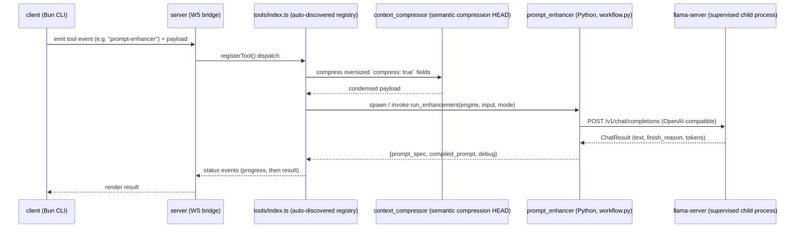

# Cowork — Prompt Enhancer

[](https://github.com/PatrickDev-it/cowork-prompt-enhancer/actions/workflows/ci.yml)
[](LICENSE)

Cowork is a locally-supervised LLM infrastructure that compiles incomplete, natural-language
requests into implementation-ready specifications for another AI to execute. It is not a thin
wrapper around a hosted API: a Bun/TypeScript server exposes a WebSocket event bridge with
capability-negotiated tools; a quantized Qwen3-8B model is served by a supervised `llama-server`
child process (health polling, exponential-backoff restart, clean shutdown); and a Python module —
the **Intent-to-Specification Compiler** — turns an underspecified prompt into a dense, sectioned
spec through a three-tier generation strategy with a deterministic fallback at every level.

23 dated engineering decisions (`.sinapsi/rfc/`) trace how the system got here — see
[Decision log](#decision-log) below.

## Why this exists

Most "prompt enhancer" projects are a single LLM call with a system prompt. This one treats prompt
enhancement as a compilation problem: extract the explicit intent, infer only what is
industry-standard or technically required to implement it (never a specific vendor or library
unless the user named one), and emit a spec dense enough for an executing AI to act on without
asking follow-up questions — while never drifting from the user's actual request.

Because the compiler sits on top of a non-deterministic model, the system is built the way you'd
build anything on top of an unreliable dependency: layered fallbacks (`compiler` → `single_pass` →
`field_loop`), a parser tolerant of malformed/mixed JSON output, and a supervised inference process
that restarts itself instead of taking the whole server down.

## Architecture



A deeper component/module-boundary diagram and an explicit threat model live in
[`docs/architecture.md`](docs/architecture.md).

**Highlights an outside reviewer won't see just by skimming file names:**

- **Measured, not guessed, performance tuning.** [`server/config.ts`](server/config.ts)'s
  `llamaServerArgs()` documents A/B benchmarks with real numbers on the target GPU — decode
  throughput, concurrent-user fairness, VRAM curves per context size, and why speculative decoding
  was tried and rejected after measuring it.
- **Capability-negotiated file operations.** The client declares which filesystem operations it can
  execute; the server refuses, loudly, to invoke anything outside that set instead of failing
  silently ([`server/tools/fs.ts`](server/tools/fs.ts)).
- **Resilient process supervision.** The `llama-server` child process has polling health checks,
  exponential-backoff restart with a cap, and shutdown hooks on `exit`/`SIGINT`/`SIGTERM`
  independent of whichever module started it ([`server/modules/llm/supervisor.ts`](server/modules/llm/supervisor.ts)).
- **Layered defense against LLM non-determinism.** Three nested generation strategies
  ([`strategies.py`](server/modules/prompt_enhancer/strategies.py)), a parser that extracts JSON
  from noisy/mixed model output, and a deterministic fallback for every single field
  ([`coercion.py`](server/modules/prompt_enhancer/coercion.py)), orchestrated by
  [`workflow.py`](server/modules/prompt_enhancer/workflow.py).
- **`strict` TypeScript, for real.** `strict` and `noUncheckedIndexedAccess` are on for both
  `client/` and `server/` — not the minimal config, the one that actually prevents unchecked-access
  bugs.

## Three-minute quickstart

The default profile is deterministic, offline, and requires no GPU, model, credential, or network after
the frozen installation:

```bash
./setup.sh                 # Windows: ./setup.ps1
bun run preflight
bun run demo:mock
```

The compiled specification is printed and written to `demo-output/prompt.md`. Failure paths are
deterministically selectable with `COWORK_MOCK_SCENARIO=malformed|context_overflow|timeout|provider_failure`.

Named profiles are `mock`, `local`, and `openai-compatible`; see
[`docs/environment.md`](docs/environment.md) for validated configuration.

### Running the full local stack

Requires the pinned toolchain and compatible local inference hardware. Binaries and models are downloaded
from the checksummed upstream artifacts; they are ignored and never redistributed.

```bash
# Provision and validate artifacts
./setup.sh --local         # Windows: ./setup.ps1 -Local

# Terminal 1 — server (supervises llama-server only in the local profile)
COWORK_PROFILE=local bun --cwd server run dev

# Terminal 2 — client CLI
cp client/.env.example client/.env
bun --cwd client run dev
```

For a configured remote endpoint, set `COWORK_PROFILE=openai-compatible`, base URL, model and credential
from the process environment. The adapter is vendor-neutral and sends only the OpenAI-compatible contract.

See [`docs/DEV.md`](docs/DEV.md) for the reproducible root command surface and development workflow.

## Decision log

Every boundary-moving decision in this codebase — protocol design, security posture, module
splits, performance tuning — goes through an RFC before it's implemented
(`.sinapsi/AGENT_INSTRUCTIONS.md`). 23 distinct RFCs are cited across the codebase; a subset has
been backfilled as real documents in [`.sinapsi/rfc/`](.sinapsi/rfc/):

| RFC | Decision |
|---|---|
| [0002](.sinapsi/rfc/0002-websocket-event-protocol.md) | WebSocket event protocol (the foundation every tool is built on) |
| [0008](.sinapsi/rfc/0008-client-declared-fileop-capabilities.md) | Client-declared file-operation capability negotiation |
| [0014](.sinapsi/rfc/0014-supervised-llama-server-process.md) | External supervised `llama-server` replaces in-process inference |
| [0015](.sinapsi/rfc/0015-semantic-context-compression-head.md) | Semantic context-compression HEAD (cross-cutting, applies before any tool runs) |
| [0018](.sinapsi/rfc/0018-intent-to-specification-compiler.md) | Intent-to-Specification Compiler (the core product mechanism) |
| [0024](.sinapsi/rfc/0024-production-concurrency-tuning.md) | Production concurrency tuning, measured on an RTX 3070 Ti |
| [0025](.sinapsi/rfc/0025-repository-launch-and-portfolio-readiness.md) | This repository's own launch plan — how it went from local folder to what you're reading now |

RFCs 0002, 0008, 0014, 0015, 0018 and 0024 above are **reconstructed retroactively** from code and
comment history (dated and labeled as such in each file) — the decisions were made when the code
was written, the documents were not. The remaining cited RFCs (0003–0007, 0009–0013, 0016–0017,
0019–0023) are not yet backfilled; that gap is tracked openly rather than hidden.

## License

[MIT](LICENSE). External runtime and model licenses are documented in
[`THIRD_PARTY.md`](THIRD_PARTY.md).
