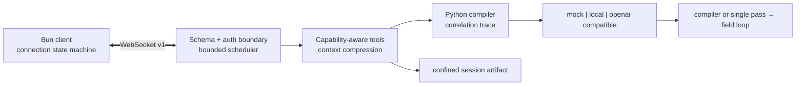

# Cowork Prompt Enhancer

[](https://github.com/PatrickDev-it/cowork-prompt-enhancer/actions/workflows/ci.yml)
[](https://github.com/PatrickDev-it/cowork-prompt-enhancer/actions/workflows/codeql.yml)
[](https://github.com/PatrickDev-it/cowork-prompt-enhancer/releases)
[](LICENSE)

Cowork compiles incomplete natural-language requests into structured specifications for an executing AI.
It treats prompt enhancement as a reliability problem: explicit requirements must survive, invented
specificity must remain bounded, malformed model output must have a deterministic delivery path, and the
local runtime must fail safely.

## Measured result

On the published eight-case stratified local reference using Qwen3-8B Q4_K_M, the compiler increased
deterministic structural validity from **0.333 to 0.792** and the executability rubric from **0.725 to
0.975** versus the raw request. Explicit-requirement precision remained **1.000**; recall changed from
**1.000 to 0.917**. Compiler latency was 8.67 s p50 and 11.97 s p95 on an RTX 3070 Ti.

This is a transparent lexical evaluation on eight cases, not human judgment or a general superiority
claim. The [report](evaluation/results/local-stratified-v1/report.md),
[raw records](evaluation/results/local-stratified-v1/records.jsonl) and
[environment](evaluation/results/local-stratified-v1/environment.json) are published together.

## Three-minute mock quickstart

Prerequisites: Bun 1.3.12 and Python 3.12.4. The setup command installs frozen dependencies; inference is
then deterministic, offline, credential-free and independent of a GPU or model download.

macOS/Linux:

```bash
./setup.sh
bun run preflight
bun run demo:mock
```

Windows PowerShell:

```powershell
.\setup.ps1
bun run preflight
bun run demo:mock
```

The compiled prompt is printed and written to `demo-output/prompt.md`. Deterministic failure injection is
available through `COWORK_MOCK_SCENARIO=malformed|context_overflow|timeout|provider_failure`. Run
`bun run demo:record` for the sanitized success, fallback, artifact and 64-case benchmark transcript.

## Provider paths

| Profile | Purpose | Activation |
|---|---|---|
| `mock` | CI, evaluation and reviewer path | Default; no configuration |
| `local` | Private Windows/Ubuntu inference through supervised llama-server | `./setup.sh --local` or `.\setup.ps1 -Local` |
| `openai-compatible` | Operator-selected compatible endpoint | Explicit base URL, model and environment credential |

All profiles implement one typed provider contract and error taxonomy. Local binaries, models and CUDA
libraries are checksummed but never committed or redistributed. See the
[environment reference](docs/environment.md) and [artifact provenance](THIRD_PARTY.md).

## Architecture



The historical field-loop remains the terminal fallback. The local profile alone owns a supervised
llama-server process with health polling, capped exponential restart and clean signal shutdown. The
[architecture and threat model](docs/architecture.md) documents lifecycle, limits and residual risk.

## Security model

- Loopback binding is the zero-configuration default.
- Non-loopback use requires explicit opt-in and a short-lived, single-use HMAC challenge; TLS termination
  remains the operator's responsibility.
- Protocol schemas, frames, payloads, queues, per-session concurrency, deadlines and reconnect attempts are
  bounded before tool execution.
- File operations require advertised capabilities and canonical confinement beneath the session root.
- Correlated traces exclude prompts and credentials; the bounded `/metrics` endpoint is opt-in and
  loopback-only.
- CI audits dependencies, scans tracked content, runs CodeQL and validates a model-free checksummed release.

Report vulnerabilities through the private channel described in [SECURITY.md](SECURITY.md).

## Evaluation and verification

`cowork-eval/v1` contains 64 non-sensitive tasks balanced across implementation, debugging, refactoring,
architecture, operations, data/ML, research and professional writing. It compares raw, thin, compiler and
field-loop strategies and separates compiler success from fallback-delivered success.

| Evidence tier | Cases / records | Role |
|---|---:|---|
| Deterministic mock | 64 / 264 | Complete reproducible harness and strategy coverage |
| Stratified local | 8 / 32 | Real-model comparison across all eight categories |

No human result is claimed. A blinded review exchange is implemented for future external ratings. Run
`bun run benchmark` for the full mock tier or inspect the [methodology and limitations](evaluation/README.md).

The complete local/release gate is:

```bash
bun run gate:release
```

It covers formatting, lint, strict typechecking, unit/integration/E2E tests, dependency audits,
documentation links, secret/heavyweight-artifact scanning, demo recording, SBOM generation and checksums.

## Limitations

- Local benchmark evidence is eight cases on one Windows/NVIDIA workstation; latency is not portable.
- Lexical metrics do not measure semantic paraphrase quality or downstream task completion.
- Loopback is a same-user trust boundary, not an operating-system sandbox.
- Remote providers receive request content and retain it under their own operator-selected policy.
- Optional web grounding performs outbound retrieval; reference benchmarks use timestamped fixtures only.

## Engineering record

Deep implementation guidance lives in [docs/DEV.md](docs/DEV.md). The decisions needed to understand the
product boundary are the [compiler](.sinapsi/rfc/0018-intent-to-specification-compiler.md),
[provider profiles](.sinapsi/rfc/0026-provider-profiles-and-configuration.md),
[protocol/security model](.sinapsi/rfc/0027-authenticated-versioned-protocol-and-resource-bounds.md) and
[evaluation evidence](.sinapsi/rfc/0028-versioned-evaluation-evidence.md). Reconstructed decisions retain
their original reconstructed label.

[MIT](LICENSE) licensed. See [support](SUPPORT.md), [contributing](CONTRIBUTING.md),
[changelog](CHANGELOG.md) and [release policy](docs/release-policy.md).
