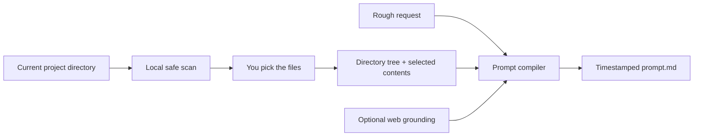
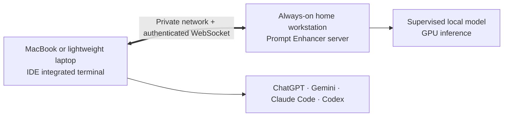
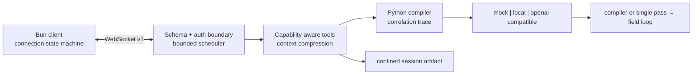

# Prompt Enhancer — Remote AI Prompt Optimizer

[](https://github.com/PatrickDev-it/ai-prompt-optimizer/actions/workflows/ci.yml)
[](https://github.com/PatrickDev-it/ai-prompt-optimizer/actions/workflows/codeql.yml)
[](https://github.com/PatrickDev-it/ai-prompt-optimizer/releases)
[](LICENSE)

> **Write it rough. Let your strongest machine optimize it.**

Prompt Enhancer is an open-source, remote-first AI prompt optimizer for developers. Keep the local model
running on an always-on, GPU-equipped desktop at home, then submit rough requests from the integrated
terminal of a MacBook or lighter laptop wherever you work. The compiler returns structured,
implementation-ready prompts for ChatGPT, Gemini, Claude Code, Codex and other AI coding agents.

The powerful machine owns supervised local inference; the portable machine owns the interactive client
and project workspace. They communicate through an authenticated WebSocket over a private network. The
generated prompt remains readable plain text, with no downstream vendor lock-in or mandatory cloud account.

[See the product page](https://patrickdev-it.github.io/projects/prompt-enhancer/) ·
[Read the AI prompt optimizer guide](docs/ai-prompt-optimizer-guide.md) ·
[Configure a remote workstation](docs/remote-ide-workstation.md) ·
[Download v1.0.0](https://github.com/PatrickDev-it/ai-prompt-optimizer/releases/tag/v1.0.0)

## It does not optimize blind

> **Point it at the current project. You choose the files. Prompt Enhancer uses the real codebase as
> ground truth.**

The project-aware developer mode scans the directory on the client machine, shows a filtered file picker
and lets you decide exactly which files become context. The compiler receives:

- a bounded directory tree, even when no complete file is selected;
- the contents of only the files you explicitly pick;
- the rough request you want the executing AI to implement;
- optional live web grounding when the task needs current information.

That changes the quality of the result. Instead of guessing the framework, architecture, naming
conventions or existing interfaces, Prompt Enhancer can build a specification around the structure and
code that already exist.



The scan excludes dependency, build, cache and VCS directories; denies common credential and secret
filenames; allowlists source/text extensions; and enforces per-file, tree and total-context budgets. The
whole repository is not silently uploaded.

## One product, two focused tools

| Tool | Best use | Capabilities |
|---|---|---|
| `dev-prompt-enhancer` | Implement, debug, refactor or plan against an existing codebase | Project-directory scan, explicit file selection, authoritative project context, optional web search, optional provider reasoning |
| `prompt-enhancer` | Turn a standalone request into a researched execution specification | Request-file selection, optional provider reasoning, opt-in Deep Research, separate research report |

### Capability stack

| Capability | What it adds |
|---|---|
| **Project Context** | Filtered directory map plus the exact source files selected from the current project |
| **Web Search** | Optional current-information grounding for the developer workflow; automatic freshness gating remains available |
| **Deep Research** | Plans 3–5 focused searches, collects bounded results and synthesizes a separate evidence-based Markdown report |
| **Provider reasoning** | Opt-in slower reasoning path when additional model deliberation is worth the latency |
| **Semantic compression** | Condenses oversized request/context fields while preserving architecture, API, dependency, constraint and task facts |
| **Safe fallback** | Malformed output, context overflow, timeout and provider failure still have a deterministic delivery path |
| **Artifact delivery** | Every successful run writes a timestamped optimized prompt; Deep Research also writes its own report |

## From rough request to executable specification

Input:

```text
add login and make it secure, use the db we already have
```

Prompt Enhancer compiles the request into a structured specification with:

- the intended outcome and explicit constraints;
- bounded assumptions and questions instead of invented certainty;
- implementation steps, security requirements and failure behavior;
- verifiable acceptance criteria and a completion checklist.

It treats prompt optimization as a reliability problem: explicit requirements must survive, invented
specificity must remain bounded, malformed model output must have a deterministic delivery path, and the
runtime must fail safely.

## The remote-first workflow



| Machine | Responsibility |
|---|---|
| Home workstation | Runs the Prompt Enhancer server, supervised llama-server and local model |
| MacBook or lighter laptop | Runs the interactive client from the IDE terminal and keeps the project workspace |
| Private network | Carries the authenticated WebSocket session; direct public port exposure is not recommended |
| Selected coding agent | Receives the vendor-neutral optimized prompt |

This is a terminal workflow, not a native IDE extension. Start with the
[remote IDE and workstation guide](docs/remote-ide-workstation.md).

Prompt Enhancer was originally developed in **Cowork mode**: the stronger desktop stayed active as the
inference host while day-to-day work continued from a portable machine. “Cowork” describes that
development mode, not the product name.

Prompt Enhancer is independent and is not affiliated with, endorsed by or an official optimizer for
OpenAI, Google, Anthropic or their products.

## Measured result

On the published eight-case stratified local reference using Qwen3-8B Q4_K_M, the compiler increased
deterministic structural validity from **0.333 to 0.792** and the executability rubric from **0.725 to
0.975** versus the raw request. Explicit-requirement precision remained **1.000**; recall changed from
**1.000 to 0.917**. Compiler latency was 8.67 s p50 and 11.97 s p95 on an RTX 3070 Ti.

This is a transparent lexical evaluation on eight cases, not human judgment or a general superiority
claim. The [report](evaluation/results/local-stratified-v1/report.md),
[raw records](evaluation/results/local-stratified-v1/records.jsonl) and
[environment](evaluation/results/local-stratified-v1/environment.json) are published together.

## Three-minute quickstart

Prerequisites: Bun 1.3.12 and Python 3.12.4. The setup command installs frozen dependencies; inference is
then deterministic, offline, credential-free and independent of a GPU or model download.

macOS/Linux:

```bash
./setup.sh
bun run preflight
bun run demo:mock
```

Windows PowerShell:

```powershell
.\setup.ps1
bun run preflight
bun run demo:mock
```

The optimized prompt is printed and written to `demo-output/prompt.md`. Deterministic failure injection is
available through `COWORK_MOCK_SCENARIO=malformed|context_overflow|timeout|provider_failure`. Run
`bun run demo:record` for the sanitized success, fallback, artifact and 64-case benchmark transcript.

## Provider paths

| Profile | Purpose | Activation |
|---|---|---|
| `mock` | CI, evaluation and reviewer path | Default; no configuration |
| `local` | Private Windows/Ubuntu inference through a supervised llama-server | `./setup.sh --local` or `.\setup.ps1 -Local` |
| `openai-compatible` | Operator-selected compatible endpoint | Explicit base URL, model and environment credential |

All profiles implement one typed provider contract and error taxonomy. Local binaries, models and CUDA
libraries are checksummed but never committed or redistributed. See the
[environment reference](docs/environment.md) and [artifact provenance](THIRD_PARTY.md).

## Architecture



The historical field-loop remains the terminal fallback. The local profile alone owns a supervised
llama-server process with health polling, capped exponential restart and clean signal shutdown. The
[architecture and threat model](docs/architecture.md) documents lifecycle, limits and residual risk.

## Run the model where the compute is

Prompt Enhancer separates the client from the inference server. Leave a powerful Windows or Ubuntu
workstation active at home, run the client from your MacBook or laptop IDE terminal, and point it to the
workstation's private address. Loopback is the safe default; non-loopback access requires explicit opt-in
and short-lived HMAC authentication. The operator remains responsible for private networking and TLS.

## Security model

- Loopback binding is the zero-configuration default.
- Non-loopback use requires explicit opt-in and a short-lived, single-use HMAC challenge; TLS termination
  remains the operator's responsibility.
- Protocol schemas, frames, payloads, queues, per-session concurrency, deadlines and reconnect attempts are
  bounded before tool execution.
- File operations require advertised capabilities and canonical confinement beneath the session root.
- Correlated traces exclude prompts and credentials; the bounded `/metrics` endpoint is opt-in and
  loopback-only.
- CI audits dependencies, scans tracked content, runs CodeQL and validates a model-free checksummed release.

Report vulnerabilities through the private channel described in [SECURITY.md](SECURITY.md).

## Evaluation and verification

`cowork-eval/v1` contains 64 non-sensitive tasks balanced across implementation, debugging, refactoring,
architecture, operations, data/ML, research and professional writing. It compares raw, thin, compiler and
field-loop strategies and separates compiler success from fallback-delivered success.

| Evidence tier | Cases / records | Role |
|---|---:|---|
| Deterministic mock | 64 / 264 | Complete reproducible harness and strategy coverage |
| Stratified local | 8 / 32 | Real-model comparison across all eight categories |

No human result is claimed. A blinded review exchange is implemented for future external ratings. Run
`bun run benchmark` for the full mock tier or inspect the [methodology and limitations](evaluation/README.md).

The complete local/release gate is:

```bash
bun run gate:release
```

It covers formatting, lint, strict typechecking, unit/integration/E2E tests, dependency audits,
documentation links, secret/heavyweight-artifact scanning, demo recording, SBOM generation and checksums.

## Limitations

- Local benchmark evidence is eight cases on one Windows/NVIDIA workstation; latency is not portable.
- Lexical metrics do not measure semantic paraphrase quality or downstream task completion.
- Loopback is a same-user trust boundary, not an operating-system sandbox.
- Remote providers receive request content and retain it under their own operator-selected policy.
- Optional web grounding performs outbound retrieval; reference benchmarks use timestamped fixtures only.

## AI prompt optimizer FAQ

### What is an AI prompt optimizer?

It converts a rough request into a clearer, more testable prompt before another AI executes it. Prompt
Enhancer focuses on developer tasks and compiles intent into requirements, constraints, assumptions,
steps and acceptance criteria.

### Does Prompt Enhancer work with ChatGPT, Gemini, Claude Code and Codex?

Yes as an output workflow: Prompt Enhancer produces portable text that can be pasted into those tools and
other AI coding agents. Its inference providers are mock, local and OpenAI-compatible; it does not claim
native plugins or official vendor integrations.

### Is Prompt Enhancer an OpenAI prompt optimizer?

Prompt Enhancer can use an operator-configured OpenAI-compatible endpoint and optimize prompts intended
for OpenAI tools, but it is an independent project and not an official OpenAI product.

### Can prompt optimization run locally or on a remote GPU machine?

Yes. The local profile supervises a private llama-server on the powerful machine, while the authenticated
client can run from a MacBook or lighter laptop IDE terminal. Use a private network; remote deployment
requires deliberate network and TLS configuration.

### Is there a native IDE extension?

Not currently. The supported workflow runs the Bun client from an IDE's integrated terminal and connects
it to the remote Prompt Enhancer server.

### Is it free?

The source code is MIT licensed. Hosted-model, network and hardware costs depend on the provider and
infrastructure selected by the operator.

## Engineering record

Deep implementation guidance lives in [docs/DEV.md](docs/DEV.md). The decisions needed to understand the
product boundary are the [compiler](.sinapsi/rfc/0018-intent-to-specification-compiler.md),
[provider profiles](.sinapsi/rfc/0026-provider-profiles-and-configuration.md),
[protocol/security model](.sinapsi/rfc/0027-authenticated-versioned-protocol-and-resource-bounds.md) and
[evaluation evidence](.sinapsi/rfc/0028-versioned-evaluation-evidence.md). Reconstructed decisions retain
their original reconstructed label.

[MIT](LICENSE) licensed. See [support](SUPPORT.md), [contributing](CONTRIBUTING.md),
[changelog](CHANGELOG.md) and [release policy](docs/release-policy.md).
