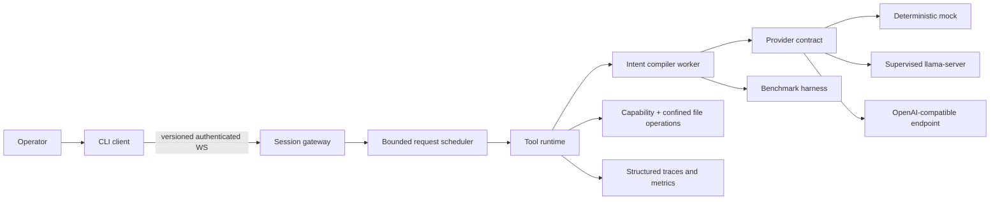

# RFC — Portfolio Flagship: Local Intent-to-Specification Compiler

- **Status:** Accepted — implementation authorized 2026-07-22
- **Scope:** portfolio projection, security hardening, evaluation and delivery of Cowork Prompt Enhancer
- **Audience:** implementation agents, systems/AI reviewers, security reviewers and recruiters
- **Relationship to existing decisions:** umbrella plan; does not supersede accepted RFCs under `.sinapsi/rfc/`
- **Decision horizon:** first public release under the owner’s GitHub profile
- **Out of scope:** Privacy organization and unrelated repositories

## 1. Executive decision

Prompt Enhancer will be the flagship project of the portfolio. Its differentiator is not “rewriting a
prompt with another prompt”; it is a locally supervised intent-to-specification compiler with explicit
fallbacks, capability-bounded file operations, model-process supervision and measurable behavior.

The next release will prioritize public reproducibility, protocol security and comparative evaluation.
No new tool category should be added until a reviewer can install the project without private workstation
state, run a GPU-free or mocked demonstration and inspect evidence that the compiler improves constraint
preservation without inventing requirements.

## 2. Product projection

### 2.1 Intended product

An engineer supplies an incomplete natural-language task and optional project context. The system returns
an implementation-ready specification that preserves explicit intent, labels conservative inferences,
avoids arbitrary technology choices and remains usable when the local model returns malformed output.

### 2.2 Portfolio role

This is the systems and applied-LLM project. It should demonstrate:

- protocol and process-lifecycle design;
- fault tolerance around non-deterministic dependencies;
- safe local filesystem capability negotiation;
- hybrid TypeScript/Python boundaries;
- local inference performance engineering;
- security threat modeling;
- evaluation methodology for generative systems;
- technical decision records used proportionally.

### 2.3 Success statement

A reviewer should be able to run a deterministic mock demonstration in minutes, optionally enable a local
or OpenAI-compatible provider, execute a benchmark suite and inspect latency, fallback and quality deltas
against a raw-prompt baseline.

## 3. Verified baseline

The repository is currently the strongest engineering asset in the portfolio:

- server and client TypeScript typechecks pass with strict and unchecked-index protection;
- Biome and Ruff pass;
- 15 Bun tests and 32 pytest cases pass;
- client and server dependency audits report no known vulnerability;
- CI, MIT license, architecture documentation and an explicit threat model exist;
- model supervision, fallback strategies and file-operation capabilities are materially implemented.

Current limitations:

- no Git remote is configured;
- README badge and links reference another/placeholder GitHub path;
- the full path requires manually provisioned Windows/NVIDIA binaries and a large model;
- WebSocket transport has no authentication and does not explicitly default to loopback;
- tests emphasize pure parsing and tool helpers rather than full request execution;
- no benchmark demonstrates output-quality improvement;
- no client test suite or robust reconnect lifecycle exists;
- 17 RFC identifiers referenced in code do not have corresponding documents;
- current worktree contains generated instruction changes that must not be overwritten casually.

## 4. Problem register and decisions

### P-01 — The project is not publicly attributable or consumable

- **Severity:** Critical
- **Evidence:** no origin remote; badge and RFC links target a placeholder/external owner.
- **Impact:** the strongest project cannot be pinned, cloned or credited reliably.
- **Decision:** create the repository under `PatrickDev-it`, configure origin, update badges/links and publish
  a signed/tagged first release after all launch gates pass.
- **Acceptance:** README links resolve, CI runs on the owner repository and release artifacts are available.

### P-02 — Installation depends on undocumented workstation state

- **Severity:** Critical
- **Evidence:** llama-server binary, CUDA DLLs, model and Python environment are manually provisioned and
  intentionally ignored.
- **Impact:** reviewers cannot reproduce the principal flow.
- **Decision:** provide setup scripts with version manifest, checksums, model-license notice, preflight and
  actionable failure messages. Private binaries are never committed.
- **Acceptance:** a clean supported machine reaches health-ready state from documented commands.

### P-03 — There is no lightweight reviewer path

- **Severity:** Critical
- **Evidence:** default product demonstration requires an NVIDIA GPU and multi-gigabyte model.
- **Impact:** most recruiters and CI systems cannot evaluate behavior.
- **Decision:** support three explicit provider modes behind the existing provider contract:
  deterministic mock, local llama-server and configured OpenAI-compatible endpoint.
- **Acceptance:** mock path runs offline in CI; local and remote adapters pass the same contract tests.

### P-04 — WebSocket trust boundary is unauthenticated

- **Severity:** Critical
- **Evidence:** any reachable client can upgrade, invoke registered tools and consume inference capacity.
- **Impact:** resource abuse, information disclosure and unauthorized tool execution.
- **Decision:** default bind to loopback for local mode; wider binding requires explicit configuration and an
  authenticated session handshake. This proposal requires compatibility review before implementation.
- **Acceptance:** anonymous, replayed and expired handshakes fail; local zero-config path remains ergonomic.

### P-05 — Protocol messages are structurally weak

- **Severity:** High
- **Evidence:** generic `{event, props}` frames and `any` listeners have only shallow runtime validation.
- **Impact:** malformed events, version drift and unclear compatibility.
- **Decision:** introduce versioned discriminated message schemas, maximum frame size and explicit error
  responses while retaining an adapter for the current protocol during one release.
- **Acceptance:** client/server generate or share types from the same schema and reject invalid frames.

### P-06 — Connection lifecycle is incomplete

- **Severity:** High
- **Evidence:** client focuses on message handling but lacks complete open/error/close, reconnect, timeout and
  backoff behavior.
- **Impact:** transient network or server restart leaves poor operator experience.
- **Decision:** explicit connection state machine with bounded exponential backoff, cancellation and user
  status.
- **Acceptance:** integration test restarts the server and observes safe reconnect without duplicate command.

### P-07 — Resource governance is incomplete

- **Severity:** High
- **Evidence:** authenticated quotas, per-session concurrency and request cancellation are not enforced at
  the protocol/application layer.
- **Impact:** one client can monopolize GPU and memory.
- **Decision:** bounded queue, per-session in-flight limit, cancellation token, input/output limits and
  backpressure-aware status events.
- **Acceptance:** concurrency tests prove fairness, bounded memory and cancellation completion.

### P-08 — Quality improvement is not measured

- **Severity:** Critical
- **Evidence:** no versioned prompt corpus, baseline comparison or human evaluation artifact.
- **Impact:** the central product claim remains subjective.
- **Decision:** create a benchmark harness with labeled intent/constraint expectations and blind review
  protocol. Evaluate raw input, thin single-pass, compiler and fallback paths.
- **Acceptance:** released report includes methodology, sample size, confidence limitations and raw results.

### P-09 — Evaluation dimensions are underspecified

- **Severity:** Critical
- **Evidence:** current tests verify deterministic helpers but not semantic adherence.
- **Impact:** an output can be well-formed yet worse for execution.
- **Decision:** score explicit-requirement recall, contradiction rate, invented-specificity rate, unresolved
  ambiguity, executability, verbosity, format validity, fallback rate and latency p50/p95.
- **Acceptance:** benchmark schema and scoring rubric are versioned before comparing models.

### P-10 — LLM failure diagnostics are hidden by fallback

- **Severity:** High
- **Evidence:** broad exceptions intentionally fall back, but root cause is not strongly surfaced to the
  operator/evaluation layer.
- **Impact:** reliability appears high while primary strategy may silently degrade.
- **Decision:** retain user-safe fallback while emitting structured internal outcome codes and counters.
- **Acceptance:** reports distinguish compiler success, parse recovery, strategy fallback and terminal error.

### P-11 — End-to-end test coverage is missing

- **Severity:** Critical
- **Evidence:** no automated test spans WebSocket, tool runtime, Python worker and fake model provider.
- **Impact:** interface regressions can pass every unit suite.
- **Decision:** run a fake-provider integration stack in CI and assert full prompt-to-artifact flow.
- **Acceptance:** protocol, status progression, fallback metadata and output file confinement are verified.

### P-12 — Model supervisor needs failure-injection proof

- **Severity:** High
- **Evidence:** lifecycle logic is implemented and documented, but coverage does not fully demonstrate crash,
  health timeout, restart cap and shutdown ordering.
- **Impact:** one of the strongest architectural claims lacks automated proof.
- **Decision:** abstract process/health controls sufficiently for deterministic supervisor integration tests.
- **Acceptance:** tests cover start, ready, crash, exponential backoff, cap, SIGTERM and no orphan process.

### P-13 — File-operation safety needs adversarial tests

- **Severity:** High
- **Evidence:** capability and path confinement are implemented on different sides of the connection.
- **Impact:** encoding, symlink or path-normalization edge cases may violate the intended boundary.
- **Decision:** add property/adversarial tests for absolute paths, traversal, mixed separators, symlinks,
  reserved names and capability mismatch.
- **Acceptance:** operations remain under the resolved session root on every supported platform.

### P-14 — Search grounding lacks evidence governance

- **Severity:** High
- **Evidence:** optional metasearch results feed compilation without a released provenance/quality report.
- **Impact:** stale or unreliable sources can introduce unsupported requirements.
- **Decision:** attach query/source metadata, clearly separate external facts from inferred requirements and
  benchmark grounded vs ungrounded behavior.
- **Acceptance:** result metadata records whether and why search ran, sources used and freshness timestamp.

### P-15 — Observability is log-centric

- **Severity:** Medium
- **Evidence:** status messages and console logs exist, but stable metrics/traces across Bun, Python and
  llama-server are limited.
- **Impact:** performance and fallback behavior are difficult to aggregate.
- **Decision:** correlation ID across processes, structured JSON logs and opt-in local metrics endpoint.
- **Acceptance:** one request trace reports queue, compression, generation, fallback and artifact timings.

### P-16 — Configuration is distributed

- **Severity:** High
- **Evidence:** many environment variables control client, server, model, search and provider behavior.
- **Impact:** invalid combinations fail late and complicate reproducibility.
- **Decision:** validated configuration schema, documented profiles and generated `.env.example` sections.
- **Acceptance:** config check explains errors without starting processes or exposing secrets.

### P-17 — Documentation process risks overwhelming product signal

- **Severity:** Medium
- **Evidence:** 23 RFC identifiers are cited, but only six are reconstructed documents; README emphasizes
  internal process heavily.
- **Impact:** reviewer may see documentation theatre rather than focused engineering.
- **Decision:** preserve truthful reconstructed RFCs, but prioritize a small curated decision index. Missing
  RFCs are backfilled only when they explain a still-relevant boundary.
- **Acceptance:** README highlights no more than the decisions needed to understand product tradeoffs.

### P-18 — Language and naming are inconsistent

- **Severity:** Medium
- **Evidence:** public docs are English while runtime strings and historical comments include Italian.
- **Impact:** international reviewer friction.
- **Decision:** public interfaces, logs and newly touched comments use English; historical text is migrated
  opportunistically rather than through a risky bulk rewrite.
- **Acceptance:** demo and error flows contain professional, consistent English copy.

### P-19 — Release and model licensing are incomplete

- **Severity:** High
- **Evidence:** code is MIT, while llama.cpp binary and selected model have separate provenance and terms not
  packaged into a release manifest.
- **Impact:** reviewer cannot evaluate redistribution and setup legality.
- **Decision:** maintain a third-party manifest with source, version, checksum and license link; scripts
  download only redistributable artifacts or instruct the operator explicitly.
- **Acceptance:** release contains SBOM/provenance for code dependencies and external runtime artifacts.

### P-20 — Scope expansion could dilute the flagship

- **Severity:** High
- **Evidence:** auto-discovered tool system makes adding features easy, while evaluation and delivery remain
  incomplete.
- **Impact:** breadth increases faster than proof and usability.
- **Decision:** feature freeze on new tool categories until P-01 through P-12 launch gates are closed.
- **Acceptance:** roadmap prioritizes evaluation, security, portability and demo over tool count.

## 5. Target architecture

Target public modes:

| Mode | Purpose | External requirements |
|---|---|---|
| `mock` | deterministic quickstart, CI and protocol demo | none |
| `local` | private GPU inference and performance showcase | supported GPU, model, llama-server |
| `openai-compatible` | accessible functional evaluation | operator-provided endpoint and credential |

## 6. Public contracts

### 6.1 Session contract

- Protocol version is negotiated before tool registration.
- Wider-than-loopback deployments require authentication.
- Each session has identity, capability set, expiry, concurrency budget and cancellation namespace.
- Messages exceeding schema or size limits are rejected before dispatch.

### 6.2 Compiler result contract

- Explicit and inferred requirements remain distinguishable.
- Generated vendor/library specificity is prohibited unless user-provided or justified by project context.
- Outcome metadata identifies provider, strategy, fallback, grounding and timing without leaking secrets.
- Artifact write is optional and confined to the session output root.

### 6.3 Provider contract

- Provider supports health/info/chat or declares unsupported capabilities.
- Timeouts and context errors use typed categories.
- Secrets never enter logs, artifacts or benchmark fixtures.
- Mock/local/remote adapters run the same conformance suite.

## 7. What must be simplified

- Keep the compiler as the product; do not add unrelated assistant tools before launch gates close.
- Replace scattered environment behavior with named validated profiles.
- Create one root workspace command surface instead of requiring package-directory knowledge.
- Reduce README decision-log prominence; retain detailed RFCs under `.sinapsi` for deep review.
- Remove dead speculative-model notes from primary docs when they no longer affect current decisions.
- Avoid Kubernetes, external queues or distributed tracing backends for the default local product.
- Preserve the existing strategy separation; do not merge parsing, prompts and orchestration back together.

## 8. Implementation plan

### Phase 0 — Public ownership and repository hygiene

- Resolve current worktree intentionally; never overwrite user changes.
- Create GitHub remote and update badge/link ownership.
- Add About metadata, topics, release naming and support/security notes.
- Introduce root scripts for install, check, test and mock demo.

**Exit gate:** clean clone, correct attribution and green CI on the owner repository.

### Phase 1 — Portable execution

- Implement deterministic provider and full mock stack.
- Add OpenAI-compatible provider through the existing contract.
- Add setup/preflight scripts and third-party artifact manifest for local mode.
- Validate configuration profiles.

**Exit gate:** mock demo works without GPU; local mode reaches health from documented setup.

### Phase 2 — Protocol and resource hardening

- Add loopback default, explicit remote opt-in and authenticated handshake.
- Add versioned schemas, frame limits, bounded queue and cancellation.
- Implement client connection state machine and reconnect policy.

**Exit gate:** security and restart integration suites pass under failure injection.

### Phase 3 — Evaluation system

- Version prompt corpus and rubric before model comparison.
- Add deterministic structural scoring and blinded human review workflow.
- Compare baseline, compiler, alternate strategy and fallback.
- Publish latency, quality, fallback and resource reports.

**Exit gate:** flagship claims are supported by reproducible benchmark artifacts.

### Phase 4 — Portfolio delivery

- Record terminal demo for mock and optional local modes.
- Shorten README and link deep documentation.
- Add one architecture deep dive, threat-model summary and benchmark dashboard.
- Publish v1 release with SBOM/provenance.

**Exit gate:** repository is ready to pin and can be evaluated in under ten minutes.

## 9. Skill projection

| Skill | Required evidence | Recruiter interpretation |
|---|---|---|
| Systems design | protocol, scheduler, process supervisor | understands lifecycle and failure domains |
| Applied LLM engineering | structured compiler and fallback hierarchy | engineers around model unreliability |
| Evaluation | benchmark corpus, rubric and baselines | measures generative quality credibly |
| Security | authenticated boundary and confined operations | reasons explicitly about trust and capability |
| Performance | measured concurrency and latency reports | tunes from hardware evidence |
| Polyglot architecture | typed Bun/Python/provider contracts | manages cross-runtime boundaries |
| Reliability | retries, cancellation and fallback telemetry | preserves service under partial failure |
| Technical communication | concise README plus sourced decisions | communicates depth without over-documenting |

## 10. Definition of done

- Repository is owned and attributable under the intended GitHub profile.
- Mock quickstart works offline from a clean clone.
- Local and remote providers pass a shared contract suite.
- Protocol is versioned; remote exposure is authenticated and resource-bounded.
- Client reconnect and server supervisor failure tests pass.
- Full prompt-to-artifact integration test runs in CI.
- Benchmark report compares meaningful baselines and exposes fallback rates.
- No known critical/high dependency issue remains unreviewed.
- External binary/model provenance and licenses are documented.
- README, demo, architecture and actual release behavior agree.

## 11. Agent operating contract

This repository already uses Sinapsi. An implementation agent must:

1. read `AGENTS.md`, `.sinapsi/AGENT_INSTRUCTIONS.md` and `.sinapsi/summary.md` before source work;
2. map every patch to one or more problem IDs in this RFC and any applicable accepted RFC;
3. propose a new `.sinapsi/rfc/` document before changing a public protocol, schema, provider contract,
   storage format or invariant not already decided here;
4. treat the filesystem as authoritative and use the Sinapsi graph only as a navigation aid;
5. preserve the historical field-loop fallback unless a dedicated migration with equivalence tests is
   accepted;
6. never commit model binaries, credentials, local `.env`, generated I/O or Python environments;
7. add failure-path tests for protocol, provider or supervisor changes;
8. run server/client typecheck, Biome, Bun tests, pytest and Ruff before handoff;
9. update benchmark artifacts when a change affects compiler semantics or performance;
10. finish every patch by appending `session.md`, rewriting `handoff.md` and updating `summary.md` in the
    order mandated by Sinapsi.

Every patch handoff must include: RFC IDs, public-contract impact, provider/protocol compatibility,
security implications, test commands/results, benchmark impact, breaking changes and remaining risk.

## 12. Rejected alternatives

- **Add more tools before evaluation:** rejected because it weakens the flagship narrative.
- **Commit llama-server/model binaries:** rejected for repository size, provenance and license reasons.
- **Require GPU for all reviewers:** rejected because it prevents practical evaluation.
- **Rely only on LLM-as-judge:** rejected because evaluation needs deterministic checks and blinded human
  review for subjective dimensions.
- **Replace WebSocket with a larger distributed platform immediately:** rejected; the transport can be
  hardened without introducing unjustified infrastructure.
- **Backfill every missing RFC mechanically:** rejected because decision documentation must explain active
  boundaries, not maximize document count.

## 13. Final goal

The finished project should be the portfolio's clearest senior-level engineering signal: a focused applied
LLM system that anticipates non-determinism, process failure, security boundaries and evaluation bias. It
must remain locally understandable and runnable while demonstrating deeper systems judgment than a hosted
API wrapper.
