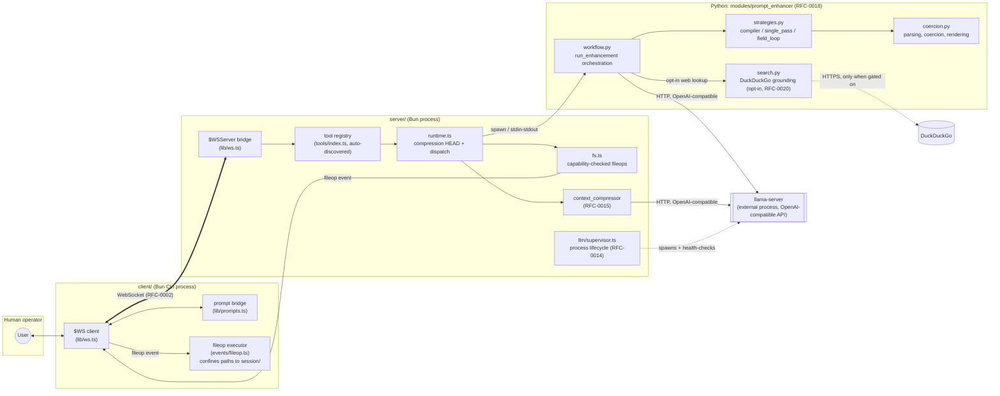
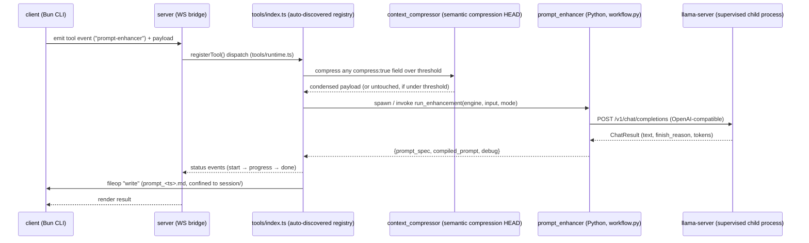

# Architecture

## System overview

Three processes, one operator. A Bun/TypeScript **server** owns a WebSocket event bridge, an
auto-discovered tool registry, and the lifecycle of a supervised **`llama-server`** child process
that serves a quantized Qwen3-8B model. A Bun/TypeScript **client** is the interactive CLI a human
drives. A Python module (**`prompt_enhancer`**) does the actual intent-to-specification compilation,
talking to `llama-server` over HTTP and never touching the model directly.

## Request sequence

A single `prompt-enhancer` invocation, compiler strategy, no grounding:

## Module boundaries

| Module | Owns | Does not own |
|---|---|---|
| `server/lib/ws.ts` | The wire protocol: JSON `{event, props}` frames, one `$WSServer` per connection (RFC-0002) | Tool logic, session state |
| `server/tools/index.ts` | Auto-discovering `Tool` exports into a registry (RFC-0003) | How a tool executes |
| `server/tools/runtime.ts` | Wiring a tool into the protocol: compression HEAD, error → `status:error`, loop-back to menu | The tool's domain logic, the compression algorithm itself |
| `server/tools/fs.ts` | Server-side capability enforcement — refusing an unadvertised fileop before it's sent (RFC-0008) | Path confinement (that's the client's job) |
| `server/modules/llm/supervisor.ts` | `llama-server` process lifecycle: spawn, health, restart, shutdown (RFC-0014) | Prompt content, sampling parameters |
| `server/modules/context_compressor` | Condensing oversized input via the shared model (RFC-0015) | Deciding *which* fields need compression (that's `PromptDescriptor.compress`) |
| `server/modules/prompt_enhancer/workflow.py` | `run_enhancement` orchestration: strategy selection, the shared fallback boundary, grounding/deep-research gathering | Individual strategy implementations, parsing |
| `server/modules/prompt_enhancer/strategies.py` | The three generation strategies — compiler, single_pass, field_loop (RFC-0018) | Rendering, parsing raw model output |
| `server/modules/prompt_enhancer/coercion.py` | Pure parsing/coercion/rendering of model output — zero model calls, zero I/O | Strategy selection, prompt templates |
| `client/lib/ws.ts` | The client half of the wire protocol, symmetric to the server's | — |
| `client/events/fileop.ts` | Executing fileops, confined to the session folder (RFC-0008 § 6) | Deciding which ops are safe to advertise (`SUPPORTED_OPS` is the static contract) |

## Threat model

This system has **one trust boundary that matters: the WebSocket connection between client and
server**, and it is currently unauthenticated. Stated explicitly, since an unstated boundary reads
as "wasn't considered" rather than "was decided":

- **No authentication at the protocol layer.** `server/index.ts`'s `Bun.serve` upgrades any
  incoming WebSocket request to a connection; the `Sec-WebSocket-Protocol` header is read into
  `SocketData.role` for logging only, not checked as a credential. Anyone who can open a TCP
  connection to the listening port can act as a client: invoke any registered tool, consume GPU
  inference time, and read whatever a tool's `status`/response payloads expose (`system-info`
  reports the server host's platform, CPU count, and memory to any connected client).
- **The server does not bind to loopback by default.** `server/index.ts` passes no `hostname` to
  `Bun.serve`, so it binds using Bun's own default rather than an explicit `127.0.0.1`. This
  project is designed to be run by a single operator on a trusted network — but that is a
  deployment assumption, not something the code enforces. Anyone deploying this with the port
  reachable beyond their own machine (LAN, a port-forward, a cloud VM with an open security group)
  is relying on network-level controls they set up themselves, not on anything in this repository.
  **Recommended follow-up** (not yet implemented — noted here rather than silently fixed, since
  changing the default could break an existing operator's remote-access setup without warning):
  default to `hostname: '127.0.0.1'`, with wider binding opt-in via an explicit environment
  variable.
- **File operations are client-enforced, not server-enforced, for path confinement.** The server
  can only ask a connected client to write/append/mkdir/delete/move a file; `client/events/fileop.ts`
  confines every path to the session folder and rejects absolute paths or `..` traversal before
  touching disk (RFC-0008 § 6). A malicious actor who can pose as the *server* to a real client
  is bounded by that confinement — they cannot direct writes outside the session folder — but they
  could still ask the client to write attacker-chosen content inside it.
- **The only outbound network call beyond the operator's own client/server pair is opt-in.**
  `server/modules/prompt_enhancer/search.py`'s DuckDuckGo lookup (RFC-0020) is gated by
  `COWORK_PROMPT_ENHANCER_SEARCH` (default `auto`, heuristic-triggered) and a per-request flag; with
  the mode set to `off` it never runs. No other module makes an external network call — inference
  is local (or, once RFC-0025 Phase 3 lands, to a provider the operator explicitly configures).
- **Secrets:** the codebase has none committed (verified during RFC-0025's Phase 0 secret sweep).
  `client/.env` carries only the server's host/port, not a credential — see `.env.example`.

## RFC coverage

23 distinct RFCs are cited across the codebase (`RFC-0002` … `RFC-0024`). Six have been backfilled
as real documents in `.sinapsi/rfc/`, chosen to span protocol design, security, ops, cross-cutting
infrastructure, product design, and performance rather than six variations on one theme — see the
table in the [README](../README.md#decision-log). The remaining cited RFCs (0003–0007, 0009–0013,
0016–0017, 0019–0023) are not yet backfilled; that gap is tracked as an open follow-up
(RFC-0025 Consequences), not hidden.
