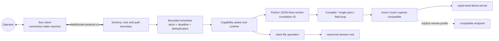
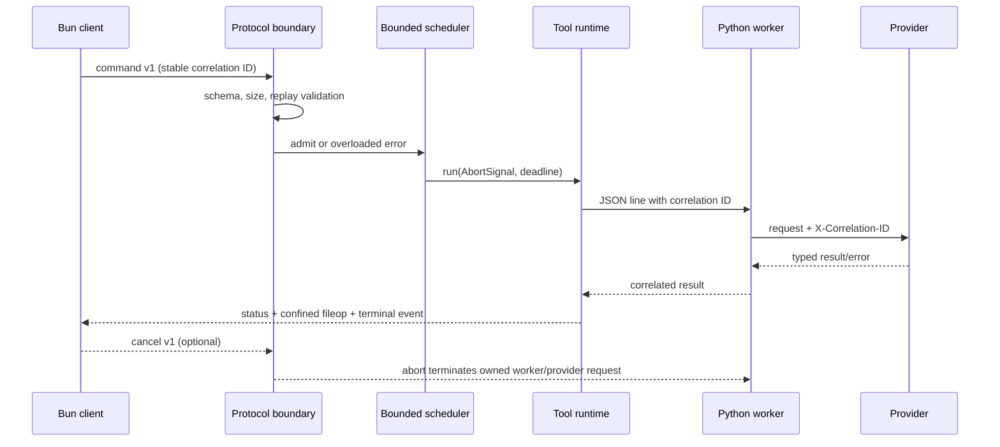

# Architecture and threat model

## System overview

AI Prompt Optimizer compiles a user request through a Bun client/server bridge and a Python workflow. The provider
profile is explicit: deterministic offline `mock`, supervised `local` llama-server, or a configured
vendor-neutral `openai-compatible` endpoint. Only `local` owns a model process.

The historical `run_enhancement_field_loop` remains unchanged. Provider, transport and scheduling
failures cannot remove the deterministic fallback from the workflow.

The versioned evaluation boundary is outside the production request path. `cowork-eval/v1` supplies
public cases and timestamped grounding fixtures to raw, thin, compiler and field-loop strategies. The
runner records credential-free provider observations, deterministic quality metrics and separate
compiler/fallback outcomes as JSONL plus environment, summary and report artifacts. Reference runs
never perform live retrieval; blinded human ratings are an optional import and are not synthesized.

## Observability

Each admitted request carries one correlation ID across the WebSocket boundary, scheduler, tool runtime,
Python worker and provider. The structured completion trace records queue, compression, generation,
provider and artifact timings; token observations; fallback and grounding state; and artifact names.
Request content, provider credentials and authentication material are excluded.

`COWORK_METRICS=true` enables a bounded snapshot of aggregate counters and the latest 100 traces at
`/metrics`. The endpoint is disabled by default, sends `Cache-Control: no-store`, and configuration
validation rejects it for non-loopback binding. Structured `request_trace` logs expose the same sanitized
record for local diagnostics.

## Protocol and request lifecycle

All application frames are discriminated protocol-v1 envelopes defined once in `protocol/index.ts`:

- client command: `{version:1, kind:"command", id, event, payload}`;
- client cancellation: `{version:1, kind:"cancel", id}`;
- server event: `{version:1, kind:"event", id, event, payload}`;
- server error: `{version:1, kind:"error", id, code, message, retryable}`.

Inbound frames are rejected before dispatch unless the version, discriminator, ID, event and payload
shape are valid. The default limits are 1 MiB per frame and 512 KiB per decoded payload. Binary and
legacy `{event, props}` frames are unsupported.

The scheduler permits four active commands globally, two per connection and 32 queued by default.
Timeout and disconnect cancellation propagate through `AbortSignal`; an active Python provider request
is terminated by stopping its owned worker. Non-terminal status updates are coalesced when socket
backpressure exceeds the configured threshold; terminal status is retained. A bounded TTL replay cache
keys stable client/command IDs so reconnect cannot duplicate a command within a running server. The
client never automatically replays a frame already sent.

## Connection and authentication

The server binds `127.0.0.1` by default. A non-loopback `COWORK_HOST` fails preflight unless
`COWORK_ALLOW_REMOTE=true` and `COWORK_AUTH_SECRET` contains at least 32 characters.

Remote authentication is a short-lived session challenge:

1. the client requests a 30-second random challenge for its stable client ID;
2. it computes HMAC-SHA-256 over challenge ID, nonce, expiry and client ID;
3. the server compares the fixed-length proof in constant time and consumes the challenge;
4. expired, anonymous and replayed upgrades return an authentication failure before WebSocket upgrade.

Challenges, proofs and secrets are never logged. The client connection state is explicit:
`connecting`, `ready`, `degraded`, `reconnecting`, `closed`; reconnect uses capped exponential backoff
with jitter.

## Filesystem boundary

The client advertises supported file operations; the server rejects capability mismatch before sending
a mutation. The client then resolves every requested path beneath the canonical session root. It rejects:

- empty, absolute, drive, UNC/device and traversal paths;
- backslash/mixed-separator paths and non-normal segments;
- Windows reserved names and trailing-dot/space aliases;
- any existing symlink or junction ancestor and any realpath outside the root.

Existing ancestors are checked before mutation. Rejected paths return the stable `path_rejected` error.
Generated artifacts remain under the per-session output directory.

## Process supervision

`LlamaSupervisor` is an injectable state machine that owns spawn, health polling, exponential restart,
restart cap and shutdown. Production uses the same state machine tested with deterministic spawn, health,
clock and signal doubles. `exit`, `SIGINT` and `SIGTERM` stop the owned child before process exit. The
model and CUDA artifacts remain outside Git.

## Supply-chain and release boundary

CI uses the mock profile and provider doubles; it never downloads or packages a model, llama-server or
CUDA runtime. Frozen Bun and hash-locked Python dependencies are audited before the release builder scans
tracked content, creates source/evidence archives, inventories dependencies, emits a CycloneDX 1.6 SBOM
and checksums every asset. Tag validation rebuilds that bundle from the tagged commit.

## Module ownership

| Module | Responsibility |
|---|---|
| `protocol/index.ts` | Shared v1 envelopes, stable errors, frame/payload validation. |
| `server/lib/auth.ts` | Single-use challenge issuance and constant-time proof verification. |
| `server/lib/ws.ts` | Per-connection dispatch, replay rejection, outbound backpressure. |
| `server/lib/scheduler.ts` | Queue/concurrency limits, deadlines and cancellation. |
| `server/lib/metrics.ts` | Bounded, sanitized request timing and outcome traces. |
| `server/tools/runtime.ts` | Compression head, scheduled tool execution and public errors. |
| `server/tools/fs.ts` | Client-advertised capability enforcement. |
| `client/events/fileop.ts` | Canonical path confinement and local mutation. |
| `server/modules/llm/supervisor.ts` | Local inference process ownership and recovery. |
| `server/modules/prompt_enhancer/` | Intent compiler, deterministic fallbacks and provider adapters. |

## Threat model and residual limitations

- Loopback is trusted as the local operator boundary. Local zero-configuration sessions intentionally do
  not require a secret; another process already running as the same user may connect to the local port.
- Path checks prevent network-directed escape but are not an operating-system sandbox against a malicious
  same-user process that races filesystem entries between validation and mutation.
- Remote transport authentication provides integrity of the upgrade, not TLS. Operators exposing traffic
  beyond a trusted network must terminate TLS and use `wss://` through an appropriate reverse proxy.
- A configured remote provider receives request content. The endpoint/model are operator-selected and
  credentials are process-environment only; no claim is made about that provider's retention policy.
- Optional DuckDuckGo grounding is outbound network access. Set `COWORK_PROMPT_ENHANCER_SEARCH=off` for
  a strictly offline run.
- The optional metrics endpoint is a local diagnostic interface, not an authenticated remote telemetry
  service; non-loopback metrics are rejected.
- Release checksums establish integrity of produced assets, not trust in upstream model behavior or a
  right to redistribute external runtime artifacts.
- Cancellation terminates the shared Python worker. Concurrent requests in that worker fail safely and
  may be retried explicitly; they are never replayed automatically.
